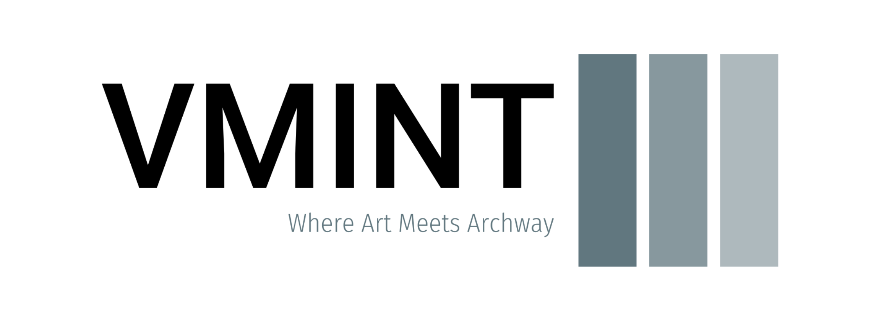
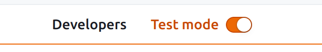
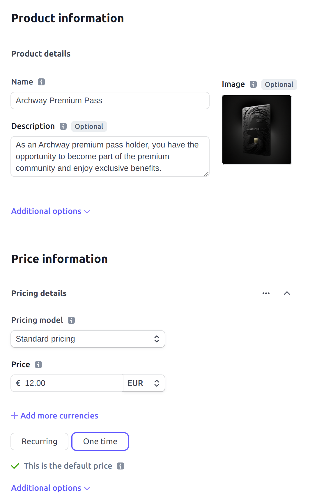
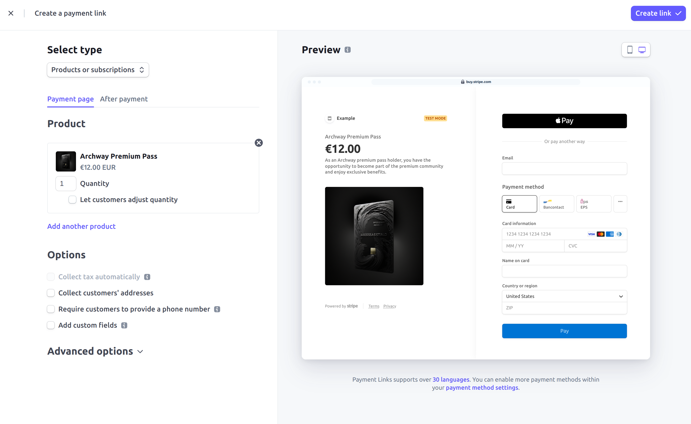
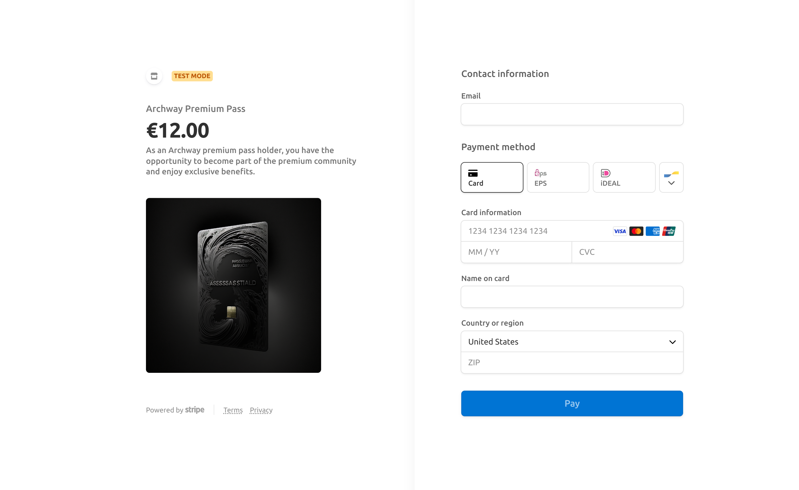
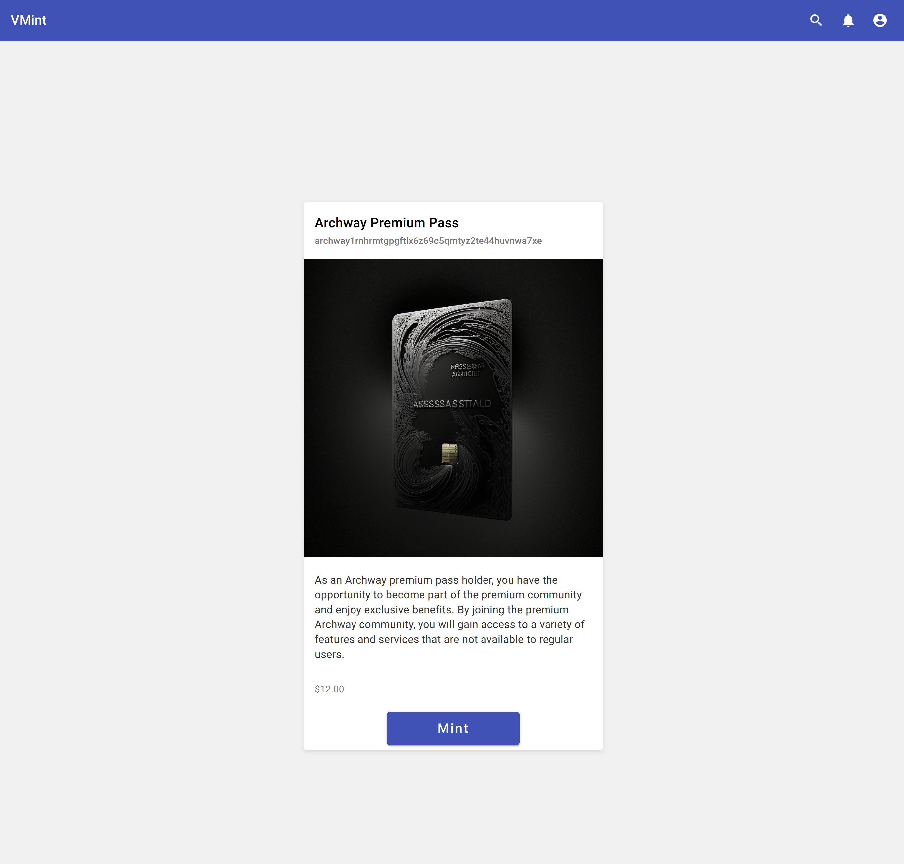

# VMint  

This platform aims to bridge the gap between Web2 and Web3 for content creators on <strong>Archway</strong>. 
The platform allows content creators to offer their virtual goods in the form of NFTs 
in exchange for fiat money. The money transfer for purchasing NFTs happens via Stripe.

## Stripe  

Stripe, a well-known payments infrastructure provider, has been serving the internet for several years. 
During this time, Stripe has become a preferred choice for many businesses 
due to its ease of use, reliability, and robust features.
With Stripe's customer registration feature, 
businesses can easily register their customers and simplify the checkout process. 
This feature also helps businesses to stay compliant with regulations 
by collecting and storing customer information securely.  

### Advantages  

This section describes the advantages of accepting fiat money instead of cryptocurrencies.

- Easier onboarding of new users to the crypto space by integrating a familiar payment process. 
- Content creators can receive their earnings off-chain without needing to sell their tokens, 
which are usually obtained through sales. 
Since these sales mostly occur with the native token of the chain, 
selling them would impact the entire ecosystem in the form of a price drop.
- As each digital asset is paid off-chain, it results in a direct inflow of value into the chain 
instead of just a transfer of value already existing on-chain. This brings real growth to the ecosystem.

## Demo  

Demonstrating the application workflow and what's needed to get the application up and running. 
Could also be seen as a "How to Guide"

### Configure Product

#### Set up an account at Stripe

Head over to [Stripe's registration form](https://dashboard.stripe.com/register) and register for an 
account if not done already.

Ensure that the Test mode is enabled to interact with Stripe's Sandbox environment. 
Verify that the Test mode is toggled in the upper right corner. If it is not enabled, 
please toggle it on.

**Note**: "Sandbox" is a testing environment provided by Stripe for developers to test their integration 
without making real payments.  

#### Create Product

Next, we need to create a Product that represents the NFT collection we want to offer on our platform. 
To do this, go to `Products` > `+ Add Product` and complete the Product Information form 
with the details of the NFT collection. 
Finally, click the `Save Product` button located in the top right corner.

#### Create Checkout Page

Stripe provides the option to create a customized checkout page for a specific product. 
To accomplish this, navigate to `Payments` > `Payment Link` > `+ New` and select the product 
for which the link should be generated. At this point, custom modifications can also be made.

Once you have completed the form, simply click the `Create Link` button 
to generate a unique link to your checkout page.
This link will be used to direct our customers to the checkout page, 
where they can easily make their purchase using their preferred payment method.

### Start the application

#### Tech stack

##### Backend

On the backend, Java and Spring Boot is used to provide a robust and scalable backend infrastructure. 
Java is a mature and widely-used programming language known for its reliability and performance, 
while Spring Boot is a popular framework that simplifies the development of Java-based applications, 
making it easier to build RESTful APIs, microservices, and more.

##### Frontend

For the frontend, I've chosen Angular, a popular and powerful web application framework 
that allows for building dynamic and responsive user interfaces. 
Angular provides a rich set of tools, features, and best practices for building modern 
and interactive web applications, making it a top choice for building engaging user experiences.

#### Configuration 

The frontend has already been pre-built and placed in the static resource folder of the webserver. 
Therefore, no further action is required on that end. 
The backend configuration is specified in the `application.yml` file.

##### API Key

To use the Stripes API, we need to include a secret key in our requests. 
Find the secret key in your Stripe Dashboard 
and put it into the `application.yml` file in the resource folder.

##### Webhook Secret

Webhooks provide real-time notifications for events and updates related to payments 
and other important activities, allowing for seamless integration and automation 
in your payment processing workflows. 
To ensure that we can mint and transfer the NFT to the buyer, we require a webhook 
that will notify us when a payment has been successfully processed.

The webhook secret allows us to verify the authenticity of requests received on the webhook endpoint.

You can configure a webhook in the Stripe dashboard or for testing and development 
set it up using the Stripe CLI. If you configure the webhook in the dashboard, 
the domain of the endpoint that receives the webhook request must be secured via HTTPS.

To test the webhook endpoint install the [Stripe CLI](https://stripe.com/docs/stripe-cli)
1. Login to your Stripe account to set up the CLI  
`stripe login`
2. Watch and forwards webhook events from Stripe to the local endpoint. 
This command will also display the **webhook secret**.  
`stripe listen --forward-to localhost:8080/api/webhooks` 
3. Trigger session completed webhook event which means a successful payment happened  
`stripe trigger checkout.session.completed`

##### Domain

To ensure that Stripe can properly handle payment success and failure callbacks, 
the domain name needs to be configured accordingly.

### Startup

Once you have completed the aforementioned steps, proceed to launch the backend. 
Upon completion, the application can be accessed through the following link: http://localhost:8080/.

## Project Status

The project is a proof-of-concept (POC) aimed at demonstrating the feasibility and potential 
of the proposed solution.

The next step in the project's roadmap is to transition from the proof-of-concept (POC) stage 
to the minimum viable product (MVP) stage. 

This would include the following features:
- Use the Stripe account API to register, store, and manage users and content creators.
- Design and implement an application process for content creators to offer their collections.
- Manage products through the Stripe API.
- Implement the web3 service to enable mint and transfer of NFTs after a successful payment.

